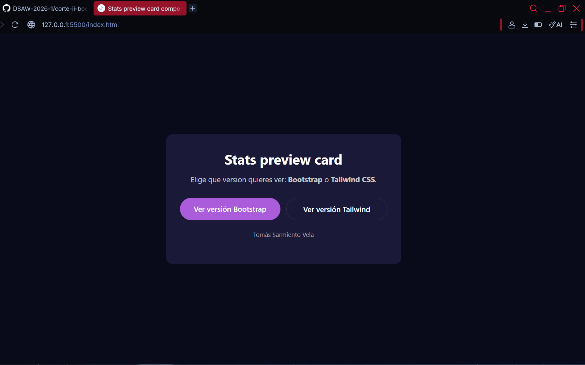
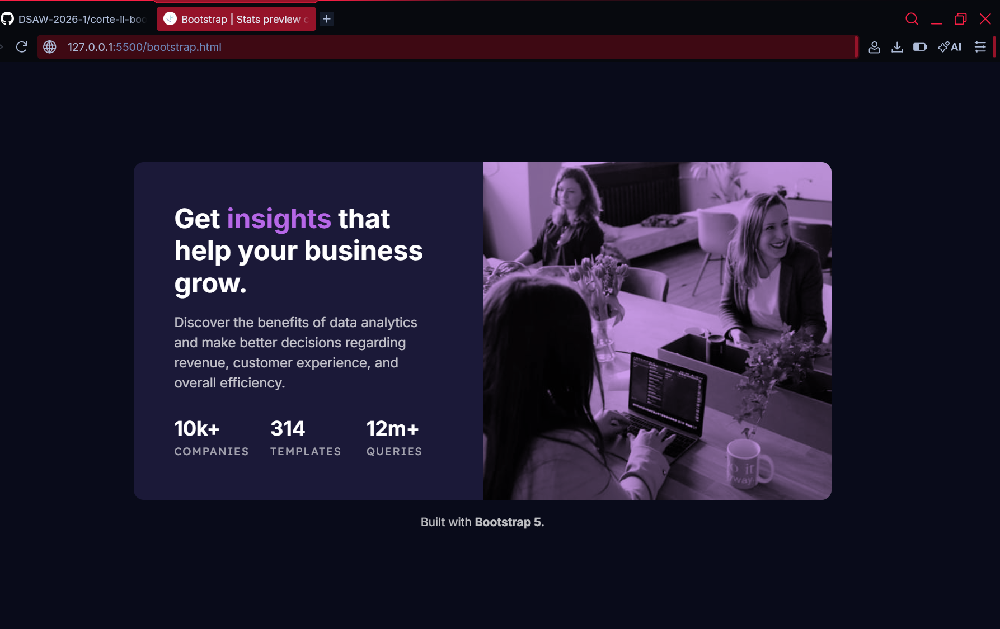
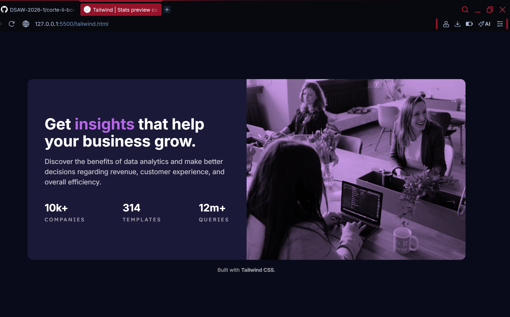

# Stats preview card component solution

## Name: Tomás Sarmiento Vela

## Table of contents

- [Overview](#overview)
  - [The challenge](#the-challenge)
  - [Screenshot](#screenshot)
  - [Links](#links)
- [Author](#author)

## Overview

### The challenge

Users should be able to:

- View the optimal layout depending on their device's screen size, using **bootstrap** and **tailwind**, so you must create two different routes.
- One for bootstrap: `/bootstrap`
- One for tailwind: `/tailwind`

### Screenshot

### Links

- Solution URL: [solution URL ](https://github.com/DSAW-2026-1/corte-ii-bootstrap-tailwind-Tomassave.git)
- Live Site URL: [live url](https://dsaw-2026-1.github.io/corte-ii-bootstrap-tailwind-Tomassave/)

### Author
- Tomás Sarmiento Vela
